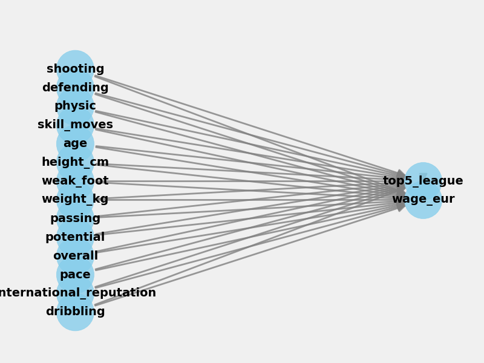

# FIFA 22 — End-to-End ML Pipeline for Player Wage Prediction

**Predicting weekly wages of professional footballers from the FIFA 22 player dataset.**

INSY 674 · Enterprise Data Science · McGill MMA · Winter 2026

---

## Problem

Player wages in professional football are driven by a complex mix of on-pitch skill, age, contract terms, club prestige, and market dynamics. This project builds an end-to-end machine-learning pipeline that predicts a player's weekly wage (in EUR) from publicly available FIFA 22 attributes, then layers a causal-inference analysis on top to estimate the *uplift* attributable to specific skill features.

The pipeline follows the structure from Aurélien Géron's *Hands-On Machine Learning* (Chapter 2) and extends it with hyperparameter search, model persistence, and causal estimation.

## Dataset

**FIFA 22 Complete Player Dataset** — 19,239 male players, 110+ attributes.
- Source: [Kaggle — Stefano Leone](https://www.kaggle.com/datasets/stefanoleone992/fifa-22-complete-player-dataset)
- File used: `players_22.csv`
- Target: `wage_eur` (weekly wage in EUR)

Download with:
```bash
bash scripts/download_data.sh
```

## Pipeline

1. **EDA & cleaning** — distribution of wages, missingness, outliers, transformations
2. **Feature engineering** — custom `BaseEstimator/TransformerMixin` classes; numeric pipeline (impute + scale) + categorical pipeline (impute + one-hot) wired through `ColumnTransformer`
3. **Modeling** — Linear / Ridge / Lasso, Decision Tree, Random Forest, Gradient Boosting, XGBoost, with `GridSearchCV` / `RandomizedSearchCV` over key hyperparameters
4. **Evaluation** — RMSE, MAE, R² on a stratified hold-out split
5. **Causal inference** (Part 2 of the assignment, Section 10 of the main notebook) — `causalml` for heterogeneous treatment effects (T-Learner, CATE distribution, HTE by player rating) and `dowhy` for a full structural causal model (define → identify → estimate → refute)
6. **Persistence** — preprocessor, feature engineer, and final model serialized to `models/` via `joblib`

## Results

The tuned **Gradient Boosting / XGBoost** regressor produces the best hold-out performance among tested models. See `notebooks/fifa_player_wage_prediction.ipynb` for full metric tables and the causal-effect estimates.



## Repo structure

```
fifa22-wage-prediction/
├── notebooks/
│   ├── fifa_player_wage_prediction.ipynb   # main pipeline
│   └── 02_end_to_end_machine_learning_project.ipynb  # textbook walkthrough
├── scripts/
│   ├── fifa_script.py          # standalone export of pipeline code
│   └── download_data.sh        # fetches dataset from Kaggle
├── models/
│   ├── fifa_preprocessor.pkl
│   ├── fifa_feature_engineer.pkl
│   └── fifa_wage_model.pkl
├── images/
│   └── causal_model.png
├── requirements.txt
├── LICENSE
└── README.md
```

## Reproduce

```bash
git clone https://github.com/ferozobaid/fifa22-wage-prediction.git
cd fifa22-wage-prediction
python -m venv .venv && source .venv/bin/activate
pip install -r requirements.txt
bash scripts/download_data.sh           # requires Kaggle API token
jupyter lab notebooks/fifa_player_wage_prediction.ipynb
```

## Author

**Feroz Obaid Khan** — Master of Management Analytics, McGill University

## License

MIT — see [LICENSE](LICENSE).
