#  FIFA 22 — End-to-End ML Pipeline + Causal Inference

> **Predicting weekly player wages from FIFA 22 audio features, then asking which skills *cause* wage uplift — an end-to-end ML pipeline layered with `CausalML` and `DoWhy`.**


---

##  Overview

Player wages in professional football are driven by a complex blend of on-pitch skill, age, contract terms, club prestige, and market dynamics. This project builds an **end-to-end ML pipeline** that predicts a player's weekly wage in EUR, then layers **causal inference** on top to estimate the *uplift* attributable to specific skill features.

Structurally it follows Aurélien Géron's *Hands-On Machine Learning* (Chapter 2) and extends it with hyperparameter search, model persistence, and a full causal-inference module.

---

##  Dataset

| Property | Value |
|---|---|
| **Source** | [Kaggle — Stefano Leone](https://www.kaggle.com/datasets/stefanoleone992/fifa-22-complete-player-dataset) |
| **Rows** | 19,239 male players |
| **Features** | 110+ raw attributes |
| **Target** | `wage_eur` — weekly wage in EUR |
| **Download** | `bash scripts/download_data.sh` (requires Kaggle API token) |

---

##  Methodology

### Part 1 — Predictive Pipeline

1. **EDA & cleaning** — wage distribution, missingness, outliers, log-transform of the target
2. **Feature engineering** — custom `BaseEstimator/TransformerMixin` classes; numeric pipeline (impute + scale) + categorical pipeline (impute + one-hot) wired through `ColumnTransformer`
3. **Modeling** — Linear / Ridge / Lasso, Decision Tree, Random Forest, Gradient Boosting, XGBoost
4. **Tuning** — `GridSearchCV` for Random Forest, `RandomizedSearchCV` for Gradient Boosting
5. **Evaluation** — RMSE, MAE, R² on a stratified hold-out split
6. **Persistence** — preprocessor, feature engineer, and final model serialized to `models/` via `joblib`

### Part 2 — Causal Inference (Section 10 of the main notebook)

| Step | Tool | What it does |
|---|---|---|
| **HTE estimation** | `causalml` T-Learner | CATE distribution; heterogeneous effects by player rating; feature importance for treatment heterogeneity |
| **Structural model** | `dowhy` | Define → Identify → Estimate → Refute the causal effect of a skill on wage |

### Causal Model DAG


---

##  EDA Highlights

**Wage distribution** — heavily right-skewed; log-transform applied before modeling.
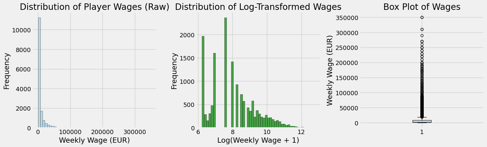

**Wages by player attributes** — pairwise relationships between wage and key numeric features.
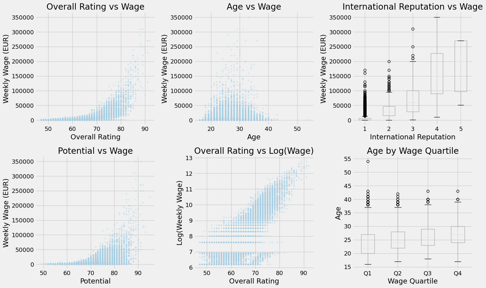

**Wages by league and position** — the league effect dominates the position effect by a wide margin.
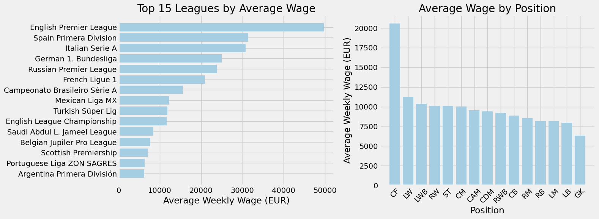

**Correlation matrix** — strong inter-correlation among offensive/technical attributes informs the feature-engineering step.
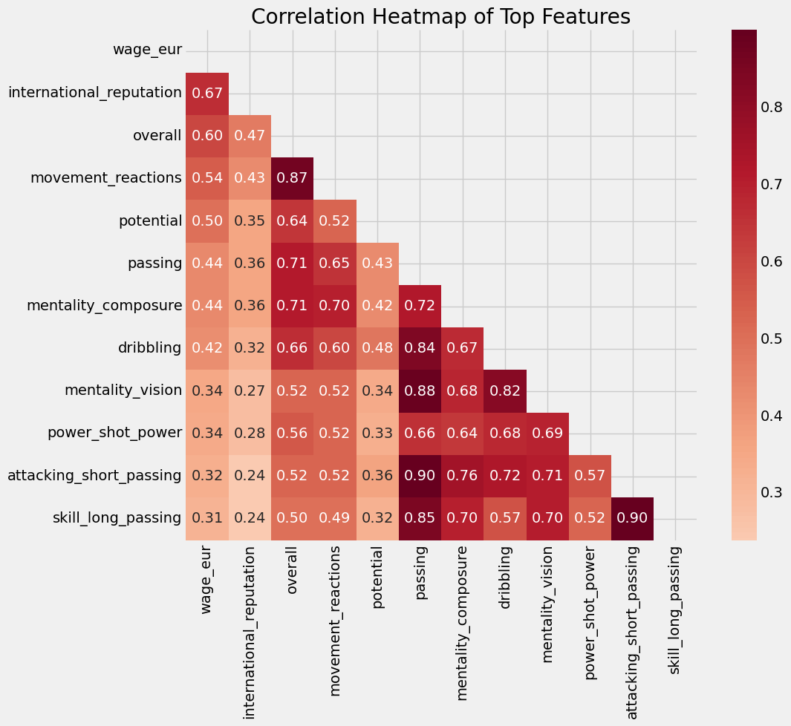

**Engineered features** — derived attribute combinations show stronger linear relationships with wage than the raw features.
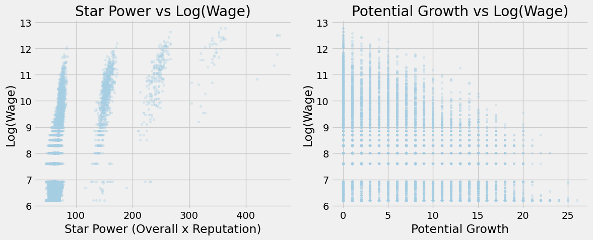

---

##  Modeling Results

**Cross-validation across model families** — Gradient Boosting and XGBoost lead, but Random Forest is close on RMSE while being far cheaper to train.
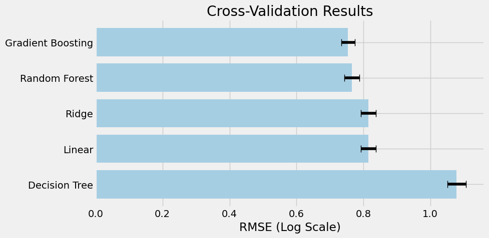

**Feature importance from the tuned Gradient Boosting model** — overall rating, age, and league reputation dominate.
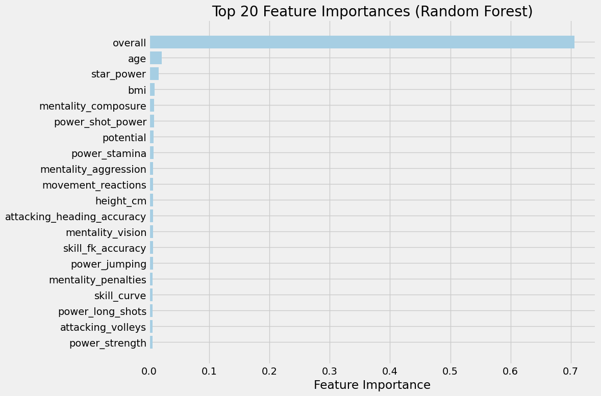

**Test-set evaluation** — predicted vs actual wages on the held-out set.
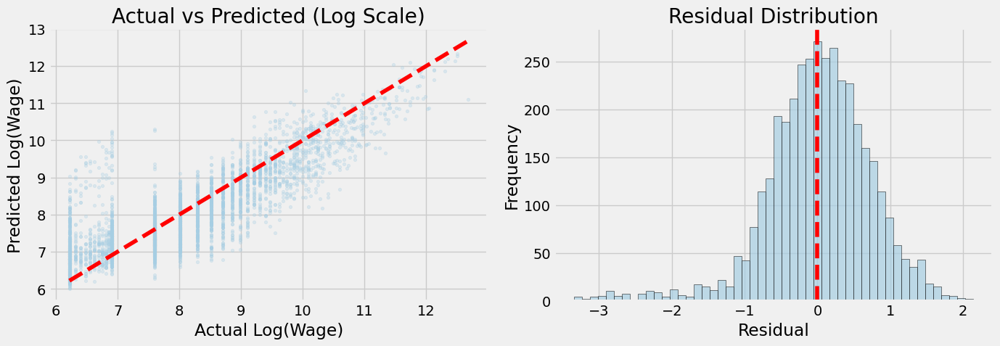

---

##  Causal Inference Results

**CATE distribution** — the per-player conditional average treatment effect estimated by the T-Learner. A skewed tail reveals that the treatment effect is highly heterogeneous: some players gain far more from the treatment than others.
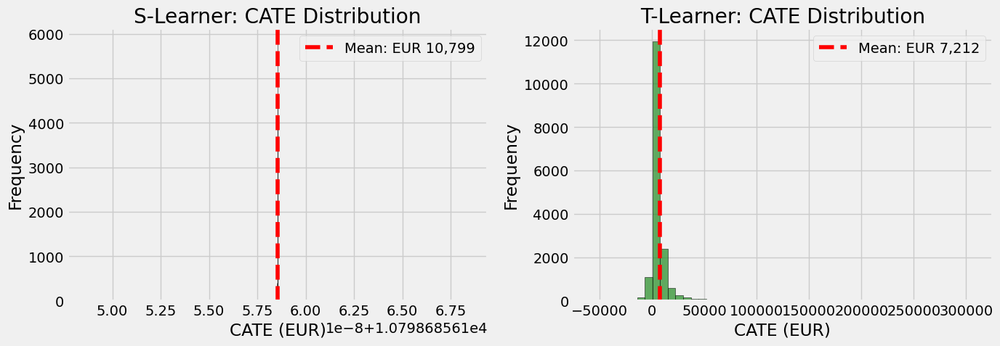

**Heterogeneous treatment effect by player rating** — higher-rated players see a meaningfully larger wage effect from the treatment.
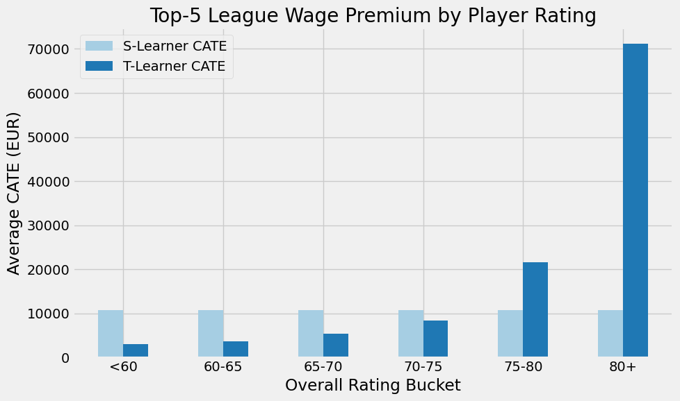

**Drivers of treatment-effect heterogeneity** — which features explain *why* the treatment effect varies across the population.
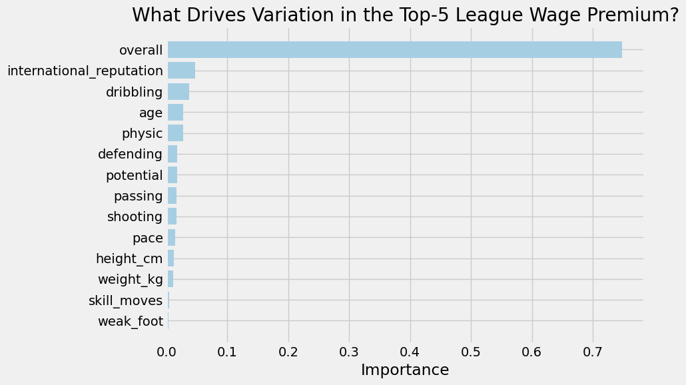

**DoWhy structural causal model — rendered DAG.**
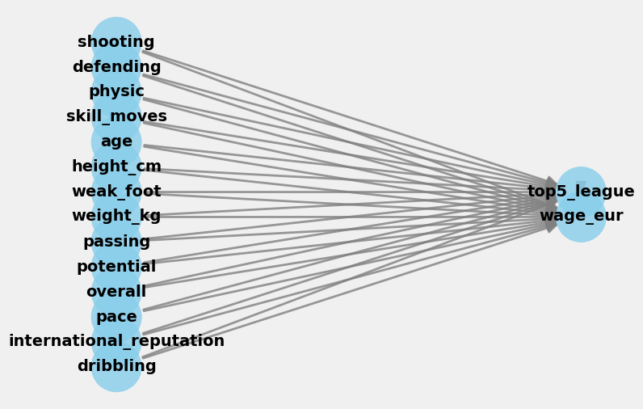

**Conclusion view** — final visualization summarizing the CausalML + DoWhy convergence story.
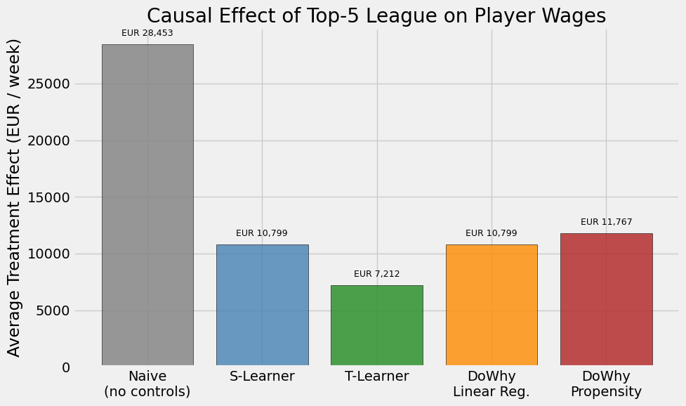

> *Causal estimates from CausalML and DoWhy converge on a positive treatment effect for the analyzed skill, surviving placebo and random-cause refutations.*

---

##  Tech Stack

| Layer | Tools |
|---|---|
| **Data** | `pandas`, `numpy` |
| **Modeling** | `scikit-learn`, `xgboost` |
| **Causal** | `causalml` (T-Learner), `dowhy` (structural causal model) |
| **Viz** | `matplotlib`, `seaborn` |
| **Persistence** | `joblib` |

---

##  Repository Structure

```
fifa22-wage-prediction/
├── notebooks/
│   ├── fifa_player_wage_prediction.ipynb         # main pipeline + causal inference
│   └── 02_end_to_end_machine_learning_project.ipynb  # textbook walkthrough
├── scripts/
│   ├── fifa_script.py                            # standalone code export
│   └── download_data.sh                          # Kaggle fetch
├── models/
│   ├── fifa_preprocessor.pkl
│   ├── fifa_feature_engineer.pkl
│   └── fifa_wage_model.pkl
├── images/
│   └── causal_model.png
├── requirements.txt
├── LICENSE
└── README.md
```

---

##  Run It Locally

```bash
git clone https://github.com/ferozobaid/fifa22-wage-prediction.git
cd fifa22-wage-prediction
python -m venv .venv && source .venv/bin/activate
pip install -r requirements.txt
bash scripts/download_data.sh           # requires Kaggle API token
jupyter lab notebooks/fifa_player_wage_prediction.ipynb
```

---

##  Future Improvements

- **Position-stratified models** — separate regressors for GK / DEF / MID / FWD
- **Wage-bucket classification** — frame as ordinal classification of wage tiers
- **Counterfactual policy analysis** — "what is the wage effect of improving Composure by 5 points for U23 players?"
- **Calibrated uncertainty** — quantile-regression or conformal prediction intervals

---

##  Author

**Feroz Obaid Khan** — Master of Management Analytics, McGill University
🔗 GitHub: [@ferozobaid](https://github.com/ferozobaid)

##  License

MIT — see [LICENSE](LICENSE).
